# About Me

System programmer exploring Machine Learning, Deep Learning, Data Science, and Cybersecurity, focused on research and building intelligent systems. I like turning ideas into code, data into insights, and bugs into unexpected learning experiences.

  
  

## @ Socials

## **`</>`** Tech Stack

## 🎓 Certifications

